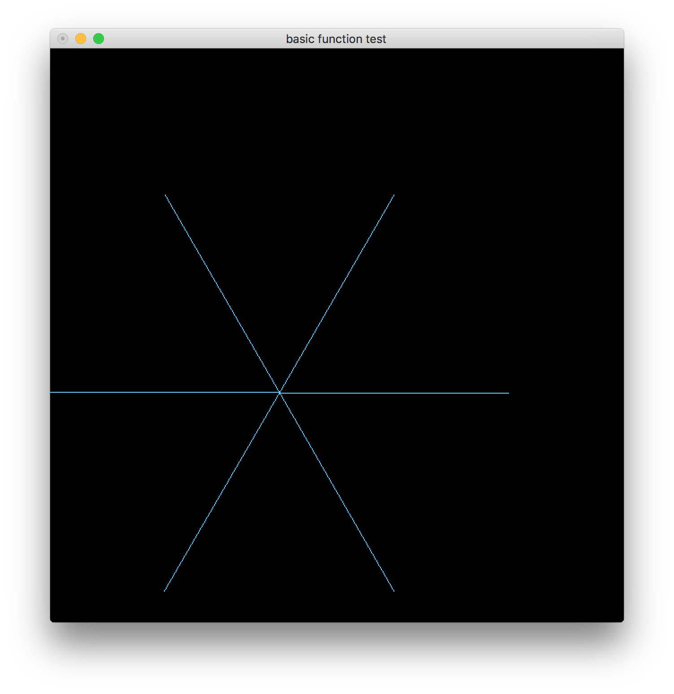

# valentine2d

an experimental replica of LÖVE(love2d) engine with OpenGL

玩具作品，不要期待。

随兴致更新，上限是我的OpenGL学习进度。



## Compile

Written on `64bit Mac OS X 10.12.3 16D32`.

Compiled with `clang`.

Uses `#pragma` to silence clang `-Wdeprecated-declarations` warnings.

```bash
$ clang --version
Apple LLVM version 8.0.0 (clang-800.0.42.1)
Target: x86_64-apple-darwin16.4.0
Thread model: posix
InstalledDir: /Applications/Xcode.app/Contents/Developer/Toolchains/XcodeDefault.xctoolchain/usr/bin
```

Compile Command

```bash
cc -llua -framework OpenGL -framework GLUT main.c
```

## Run

```
$ ./a.out
```

Configuration is `conf.lua`

```lua
-- set window size
size_w = 768
size_h = 768

-- set window position
pos_x = (1440-size_w)/2
pos_y = (900-size_h)/2

-- set window title
title = "basic function test"
```

Drawing script is `main.lua`

```lua
setColor(102, 204, 255)

for i = 1, 6 do
    drawLine(
        256, 256,
        256+256*math.cos(math.pi*i/3),
        256+256*math.sin(math.pi*i/3)
    )
end
```
